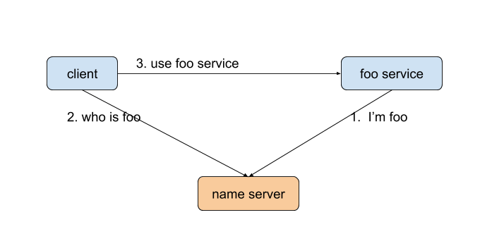

### binder 情景分析 —— service 查询

#### 概述



我们说，在使用一个服务的时候，客户端并不知道服务的位置，所以需要跟名字服务器查询。在 binder 架构中，扮演名字服务器这个角色的，就是 service manager。

查询一个服务很简单，只需要两个行代码就可以了：
```C++
sp<IServiceManager> sm = defaultServiceManager();
sp<IMountService> mountService = interface_cast<IMountService>( sm->getService(String16("mount")) );
```

关于 `defaultServiceManager()`，`interface_cast` 在文章[service 的注册](./binder-service-registration-part1.md)中已经讲得很清楚，这里就不再赘述。


#### 发出请求

我们知道（如果你不知道，请看[这篇文章](./binder-service-registration-part1.md)），上面所取得的 `IServiceManager` 实际上是 `BpServiceManager`。这里直接看他的 `getService` 函数：
```C++
// frameworks/native/libs/binder/IServiceManager.cpp
virtual sp<IBinder> getService(const String16& name) const
{
    unsigned n;
    for (n = 0; n < 5; n++){
        if (n > 0) {
            sleep(1);
        }
        sp<IBinder> svc = checkService(name);
        if (svc != NULL) return svc;
    }
    return NULL;
}
```
可以看到，实际上是调用 `checkService()` 来获取真正的服务。并且，如果失败，在睡眠 1 秒后重新尝试，最多重试 4 次。

```C++
// frameworks/native/libs/binder/IServiceManager.cpp
virtual sp<IBinder> checkService( const String16& name) const
{
    Parcel data, reply;
    data.writeInterfaceToken(IServiceManager::getInterfaceDescriptor());
    data.writeString16(name);
    remote()->transact(CHECK_SERVICE_TRANSACTION, data, &reply);
    return reply.readStrongBinder();
}
```
我们知道，`remote()->transact()` 调用的是 `BpBinder` 的 `transact()` 函数，然后到 `IPCThreadState`，最后写入 binder 驱动。这个过程我们之前已经分析过，这里就不讨论了。

唯一需要注意的是，这里我们没有往 `Parcel` 写入 `BBinder`，所以 binder 驱动不会为我们创建一个 `binder_node`。

假设已经收到响应，我们看看最后的 `readStrongBinder`（也可以先跳过这里，看完文章再回过头来看）。

```C++
// frameworks/native/libs/binder/Parcel.cpp
sp<IBinder> Parcel::readStrongBinder() const
{
    sp<IBinder> val;
    readNullableStrongBinder(&val);
    return val;
}

// frameworks/native/libs/binder/Parcel.cpp
status_t Parcel::readNullableStrongBinder(sp<IBinder>* val) const
{
    return unflatten_binder(ProcessState::self(), *this, val);
}

// frameworks/native/libs/binder/Parcel.cpp
status_t unflatten_binder(const sp<ProcessState>& proc,
    const Parcel& in, sp<IBinder>* out)
{
    const flat_binder_object* flat = in.readObject(false);

    if (flat) {
        switch (flat->type) {
            case BINDER_TYPE_BINDER:
                *out = reinterpret_cast<IBinder*>(flat->cookie);
                return NO_ERROR;
            case BINDER_TYPE_HANDLE:
                *out = proc->getStrongProxyForHandle(flat->handle);
                return NO_ERROR;
        }
    }
    return BAD_TYPE;
}
```

1. 一般情况下，`flat->type` 是 `BINDER_TYPE_HANDLE`，继续调用 `getStrongProxyForHandle()` 获取对应的 `BpBinder`。
2. 当查询的服务跟自己位于同一个进程时，`flat->type` 是 `BINDER_TYPE_BINDER`，返回 `flat->cookie` 就可以了，它存储着对应的 `BBinder` 的指针。


我们继续看 `getStrongProxyForHandle()`：
```C++
// frameworks/native/libs/binder/ProcessState.cpp
sp<IBinder> ProcessState::getStrongProxyForHandle(int32_t handle) {
    handle_entry* e = lookupHandleLocked(handle);
    if (b == NULL || !e->refs->attemptIncWeak(this)) {
        b = new BpBinder(handle); 
        e->binder = b;
        result = b;
    } else {
        result.force_set(b);
        e->refs->decWeak(this);
    }
    return result;
}
```
我们先查询是否存在跟这个 `handle` 对应的 `BpBinder`，如果不存在，就新建一个，同时把新创建的这个缓存起来。所以，对于同一个 `handle`，只会生成一个 `BpBinder`。

到这里，客户端部分我们就讲完了。下面看看 service manager 方面的工作。

#### service manager 处理请求

```C
// frameworks/native/cmds/servicemanager/service_manager.c
int svcmgr_handler(struct binder_state *bs,
                   struct binder_transaction_data *txn,
                   struct binder_io *msg,
                   struct binder_io *reply)
{
    // ...

    switch(txn->code) {
    case SVC_MGR_GET_SERVICE:
    case SVC_MGR_CHECK_SERVICE:
        s = bio_get_string16(msg, &len);
        if (s == NULL) {
            return -1;
        }
        handle = do_find_service(s, len, txn->sender_euid, txn->sender_pid);
        if (!handle)
            break;
        bio_put_ref(reply, handle);
        return 0;

    // ...
    }
    bio_put_uint32(reply, 0);
    return 0;
}
```
service manager 部分其实很简单，如果对应的服务名曾经注册过，就返回对应的 handle，没有的话就只是往 `reply` 写个 0。

`svcmgr_handler` 返回后，回到 `binder_parse()` 函数：
```C
// frameworks/native/cmds/servicemanager/binder.c
int binder_parse(struct binder_state *bs, struct binder_io *bio,
                 uintptr_t ptr, size_t size, binder_handler func)
{
    // ...

    switch (cmd) {
    case BR_TRANSACTION: {
        // ...

        res = func(bs, txn, &msg, &reply);
        if (txn->flags & TF_ONE_WAY) {
            binder_free_buffer(bs, txn->data.ptr.buffer);
        } else {
            binder_send_reply(bs, &reply, txn->data.ptr.buffer, res);
        }
        break;
    }
    // ...
    }
}
```
这里的 `func` 参数就是上面我们看到的 `svcmgr_handler`。`svcmgr_handler` 返回后，调用 `binder_send_reply` 将响应写入 binder 驱动，以返回给调用者。

下面我们看看 binder 驱动的对这个响应的处理。

#### binder 驱动对响应的处理

```C
// kernel/common/drivers/android/binder.c
static int binder_thread_write(struct binder_proc *proc,
                               struct binder_thread *thread,
                               binder_uintptr_t binder_buffer, size_t size,
                               binder_size_t *consumed)
{
    // ...

    switch (cmd) {
    case BC_TRANSACTION:
    case BC_REPLY: {
        struct binder_transaction_data tr;

        if (copy_from_user(&tr, ptr, sizeof(tr)))
            return -EFAULT;
        ptr += sizeof(tr);
        binder_transaction(proc, thread, &tr,
                   cmd == BC_REPLY, 0);
        break;
    }
    // ...
    }
}

// kernel/common/drivers/android/binder.c
static void binder_transaction(struct binder_proc *proc,
                               struct binder_thread *thread,
                               struct binder_transaction_data *tr, int reply,
                               binder_size_t extra_buffers_size)
{
    // ...

    for (; offp < off_end; offp++) {
        // ...

        switch (hdr->type) {
        case BINDER_TYPE_HANDLE:
        case BINDER_TYPE_WEAK_HANDLE: {
            struct flat_binder_object *fp;

            fp = to_flat_binder_object(hdr);
            ret = binder_translate_handle(fp, t, thread);
            if (ret < 0) {
                return_error = BR_FAILED_REPLY;
                return_error_param = ret;
                return_error_line = __LINE__;
                goto err_translate_failed;
            }
        } break;

        // ...
        }
    }
}
```
回想一下，上面 service manager 写的是一个 `handle`，相应的，这里的 `hdr->type` 就是 `BINDER_TYPE_HANDLE`。

`to_flat_binder_object()` 只是从 `hdr` 里面拿到对应的 `flat_binder_object` 对象的指针，这个函数我们不需要理会太多，重点需要关注后面的 `binder_translate_handle`。在这个函数里，binder 将再次施展它的魔法。

```C
// kernel/common/drivers/android/binder.c
static int binder_translate_handle(struct flat_binder_object *fp,
                                   struct binder_transaction *t,
                                   struct binder_thread *thread)
{
    struct binder_proc *proc = thread->proc;
    struct binder_proc *target_proc = t->to_proc;
    struct binder_node *node;
    struct binder_ref_data src_rdata;
    int ret = 0;

    // 根据 handle 值拿到对应 binder_node
    node = binder_get_node_from_ref(proc, fp->handle,
            fp->hdr.type == BINDER_TYPE_HANDLE, &src_rdata);

    binder_node_lock(node);
    // target_proc 就是向 service manager 发起请求的那个进程
    if (node->proc == target_proc) {
        // 如果相等，说明所查询的那个服务，实际上跟请求者位于同一个进程
        // 既然位于同一个进程，就可以直接返回对应的 BBinder 对象
        if (fp->hdr.type == BINDER_TYPE_HANDLE)
            fp->hdr.type = BINDER_TYPE_BINDER;
        else
            fp->hdr.type = BINDER_TYPE_WEAK_BINDER;
        fp->binder = node->ptr;
        fp->cookie = node->cookie;
        if (node->proc)
            binder_inner_proc_lock(node->proc);
        binder_inc_node_nilocked(node,
                     fp->hdr.type == BINDER_TYPE_BINDER,
                     0, NULL);
        if (node->proc)
            binder_inner_proc_unlock(node->proc);
        binder_node_unlock(node);
    } else {
        int ret;
        struct binder_ref_data dest_rdata;

        binder_node_unlock(node);
        ret = binder_inc_ref_for_node(target_proc, node,
                fp->hdr.type == BINDER_TYPE_HANDLE,
                NULL, &dest_rdata);
        if (ret)
            goto done;

        fp->binder = 0;
        fp->handle = dest_rdata.desc;
        fp->cookie = 0;
    }
done:
    binder_put_node(node);
    return ret;
}
```

我所说的 binder 施展的魔法，是指如果查询的服务跟自己在同一个进程，就会直接返回对应的 `BBinder`，拿到 `BBinder` 后的都只是进程内函数的直接调用，不需要再通过 binder 驱动。

这个也就是我们平时写应用时说的，如果服务在同一个进程，AIDL 并不会走进程间通信。

<br><br>

